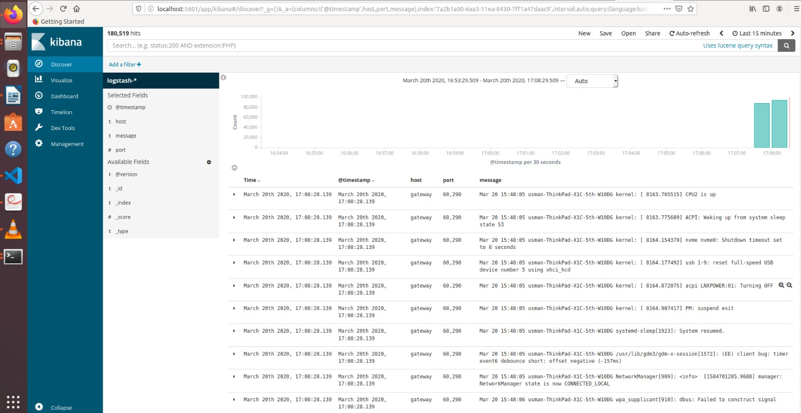

# BasicELKDocker

This is the implementation of very basic of deployment of ELK stack on Dockers.

**----Solution of tasks-----**

The docker files of each image are located in each folder
  .       a. For Elasticsearch -> /Elasticsearch/Dockerfile
          b. For Kibana        -> /Kibana/Dockerfile
          c. For Logstash      -> /Logstash/Dockerfile
  
The docker compose file is build from the docker images and is in /Docker-compose.yml
  
The standalone health check script is written in python usind Docker SDK for python.
          For health check the container is first checked if its running and then a echo command is run from that 
          container, confirming that container is healthy.
          For ref:
          https://docker-py.readthedocs.io/en/stable/api.html#
          Files located in: /pyScripts
          
The script for random destroy of contianer is also implemented usind Docker SDK for python.
          Files located in: /pyScripts
  
  **----How To Run----**
  
  **Note**: run **sudo sysctl -w vm.max_map_count=262144** otherwise the elasticsearch container will stop.
            for running **sendLog.sh** change permission to **sudo chmod +x sendLog.sh** so script sending system logs 
            to logstah becomes executable.
  
  (Assumes that system has python running)
  1. Clone the repository in your local machine.
  2. pip install docker (For docker SDK python)
  3. Goto /basicElk/docker-compose.yml
  4. Once all the containers are started goto the browser 
      1. localhost:9200 --> Elasticsearch
      2. localhost:5601 --> For kibana dashboard
  5. To send data to logstash run the bash script --> **sendLog.sh**. This basically uses netcat to open send syslog
     file to port 5000/tcp.
  6. To check the heath run the python script in /pyScripts/HealthCheck.py
  7. For randomly destroying the container run  /pyScripts/RandomRemove.py
  
  
  **Screen Captures**
                   
   **Complete Working Demo**
   

  

  

                    
                    
  **Docker Compose**
               
                    
  **Elastic Search**
  
   
                    
                    
   **Setting Kibana**
   
   
   
                    
                    
  **Running Kibana**
  
   
                    
**Sending Logs to Logstash TCP/5000**

    
                    
                    
**Health Check**
                  
            
            
  
  
  
 
